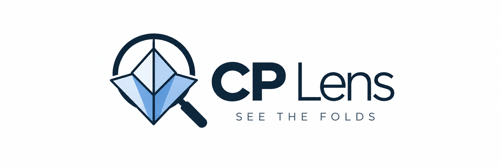

# CP Lens

<div align="center">
  
  <br />
  <h3>Geometric OCR and a Figma-like workspace for origami crease patterns.</h3>
  <p>Turn a crease-pattern image into editable geometry, inspect rational coordinates, find foldable references, and export a clean CP.</p>
</div>

CP Lens is a local-first React/TypeScript application for origami designers. It keeps the source raster and the reconstructed paper geometry separate: the paper is rectified into normalized coordinates from `(0, 0)` to `(1, 1)`, while screen pixels are used only for rendering and interaction.

## What it does

- Accepts a drag-and-drop, pasted, or selected image.
- Includes the bundled CP and Dove examples plus a **Schwarz lantern CP** test preset loaded from Wikimedia Commons (CC0).
- Proposes the dense CP region and paper boundary.
- Detects colored crease centerlines with a deterministic directional scanner, including short fragments and non-grid directions such as 22.5°.
- Runs analysis in a Web Worker so pan, zoom, and selection stay responsive.
- Displays vector lines over the raster source with Vector, Overlay, and Image views.
- Infers a likely lattice and shows rational coordinate approximations with residuals.
- Provides screen-pixel snapping, cursor-centered zoom, loupe inspection, crosshair rulers, measurements, symmetry, and direct paper-corner calibration.
- Includes a local WebAssembly port of Robert J. Lang’s ReferenceFinder for candidate folding sequences. The local search is intentionally bounded; the external ReferenceFinder remains available for deeper searches.
- Exports `.cp`, `.ori`, SVG, project JSON, reference-point CSV, and measurement CSV files.

## Quick start

Requirements: Node.js 18 or newer and npm.

```bash
git clone https://github.com/escaperr94/cp-lens.git
cd cp-lens
npm install
npm run dev
```

Open `http://localhost:5173/`. The app loads the bundled `CP.png` example. Use the `+` button to choose another image, paste an image directly into the workspace, or choose **Schwarz CP** to test a second pattern from the web.

Useful scripts:

```bash
npm run build    # Typecheck and create dist/
npm test        # Run Vitest tests
npm run preview  # Serve the production build locally
```

## Publish to GitHub

From the repository root, review the diff and commit the tracked source and assets:

```bash
git add src public README.md banner.png index.html package.json package-lock.json *.config.* tsconfig.json
git commit -m "improve Figma-style measurement and reference point tools"
git push -u origin main
```

If `origin` is not configured yet, create an empty GitHub repository first and run `git remote add origin <repository-url>`.

## Typical workflow

1. Load an image. CP Lens proposes a paper region and starts analysis.
2. Inspect the result in **Overlay** mode. The raster stays visible underneath the vector lines so alignment errors are easy to spot.
3. Choose **Calibrate Paper** and drag the TL/TR/BR/BL handles if the crop or perspective is wrong. Calibration is editable at any time.
4. Use **Grid** to choose or adjust divisions. Grid values are suggestions; they do not move the detected geometry.
5. Hover an intersection or reference point. The inspector shows the raw normalized coordinate, nearest fraction, grid residual, and confidence.
6. Use **Point**, **Measure**, or **Ruler** for manual corrections. In Select mode, drag a point to reposition it; drag a measurement endpoint to edit it. Measure supports both click-click and one continuous drag. Snapping is measured in screen pixels and can be toggled with `S`.
7. Select a point and open **ReferenceFinder** to edit its normalized coordinates, convert to Robert Lang’s bottom-left origin, and search for short folding sequences.
8. Use **Export** to save a CP/SVG file or preserve the complete project as JSON.

## Keyboard shortcuts

| Key | Action |
| --- | --- |
| `V` | Select |
| `H` / `Space + drag` | Pan |
| `P` | Add reference point |
| `L` | Draw crease |
| `M` | Measure two points |
| `R` | Crosshair ruler |
| `G` | Grid tool |
| `S` | Toggle snapping |
| `0` | Fit paper |
| `1` | 100% zoom |
| `Cmd/Ctrl + K` | Command palette |
| `Cmd/Ctrl + Z` | Undo |
| `Cmd/Ctrl + Shift + Z` | Redo |

Scroll or trackpad zoom is cursor-centered. Double-click zooms toward the pointer. Hold `Alt` for the loupe.

## Architecture

```text
raster image → CP region → paper calibration → normalized geometry
             → raster centerlines → lattice suggestions → intersections
             → reference points → editable canvas and exports
```

The frontend is React 18 + TypeScript + Vite, with Konva/React-Konva for the canvas, Zustand for state, Tailwind CSS for UI, a worker-based raster centerline extractor, and Vitest for geometry tests. `public/vendor/reference-finder/` contains the WebAssembly engine and its GPL license/source archive.

## Notes on accuracy

Detected lines, grid coordinates, and reference points are proposals. The inspector always keeps the raw coordinate and residual visible; a fraction is marked as approximate until the user explicitly edits or locks the geometry to a grid. For difficult scans, calibrate the paper corners first and use Overlay mode to verify the alignment before exporting. The Schwarz lantern sample is [David Eppstein's CC0 Wikimedia Commons file](https://commons.wikimedia.org/wiki/File:Schwarz_lantern_crease_pattern.svg).

## License

The CP Lens application code is released under the MIT License. The bundled ReferenceFinder engine is distributed under the GNU GPL; see [`public/vendor/reference-finder/LICENSE.txt`](public/vendor/reference-finder/LICENSE.txt) and the included source archive for its terms.
